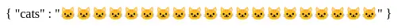
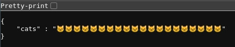

The following code snippets showcase  
how you can return content based on a  
client query via a search query.

<br/>

### layout/theme.liquid

Propagates alternative layouts. 

```liquid



<html>
    ... 
</html>
```

<br/>

### snippets/Layout.liquid

Renders alternative layouts.

```liquid

```

<br/>

### snippets/Endpoints.liquid

Checks whether the search query starts with a given marker.

```liquid
{%- liquid

    #
    #   Snippet : 𝗘𝗻𝗱𝗽𝗼𝗶𝗻𝘁𝘀
    #

    #
    #   𝗣𝗮𝗿𝗮𝗺𝗲𝘁𝗲𝗿𝘀
    #   @ search
    #

    ############################################################################

    assign query = search.terms

    assign initial = query | truncate : 1 , ''

    ############################################################################

    unless initial == '🐱'
        break
    endunless

    ############################################################################

    assign query = query | remove_first : initial

    ############################################################################

    render 'Endpoint-Cats' with query

-%}
```

<br/>

### snippets/Endpoint-Cats.liquid

Returns JSON with as many 🐱s as the query specified.

```liquid


{
    "cats" : {{ cats | json }}
}
```

<br/>

### Output

When you navigate to `/search?q=🐱20`



When you open to `/search.json?q=🐱20`


